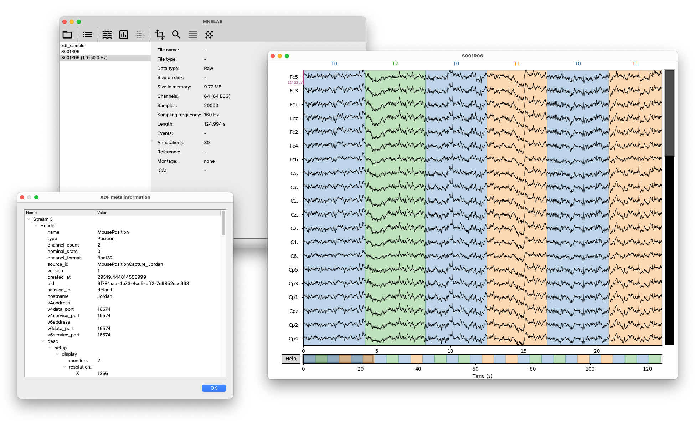

# Summary
[MNELAB](https://github.com/cbrnr/mnelab) is a graphical user interface (GUI) for [MNE-Python](https://mne.tools/stable/index.html) [@Gramfort:2013], which is currently the most popular Python package for analyzing human neurophysiological data including EEG (electroencephalography), MEG (magnetoencephalography), ECoG (electrocorticography), and NIRS (near-infrared spectroscopy). Although MNE-Python has been actively maintained for over 11 years (with its first stable release published in March 2022), the only way to interact with the package is still exclusively through Python code.

# Statement of need
Of course, writing code to analyze data has several key advantages (such as reproducibility and straightforward generalization to new data sets), but a GUI is better suited for a few specific use cases.

First, getting a quick overview of a given data set is often faster with MNELAB. The file can simply be dragged onto the main window, which will automatically import the data. MNELAB displays important properties of the data set, such as the number and types of channels, the total duration of the signals, the sampling frequency, its size in memory and on disk, and so on. Generating a time series plot or calculating the power spectral density for interactive data inspection is also only a mouse click away. Figure 1 shows the MNELAB main window (top left), a tree view listing metadata (bottom left), and raw EEG traces in an interactive signal browser (right).

In contrast, the same analysis in the interactive Python interpreter (without a GUI) involves (1) specifying the full path of the file (or setting the working directory appropriately), (2) importing MNE-Python, (3) reading the file with a suitable reader function, (4) printing the properties of interest, and (5) generating plots with corresponding methods. The following example shows what these steps might look like:

```python
import mne
raw = mne.io.read_raw("/path/to/data.edf")
print(raw.info)
raw.plot()
raw.plot_psd()
```



This code snippet also illustrates the second major use case for MNELAB. Users without a strong programming background in Python might find it difficult to implement these steps on their own. In fact, at least basic knowledge of MNE-Python and its underlying design principles is required to find the right functions and methods. Conversely, MNELAB can be used by complete novices, because available functions are explicitly exposed as menu items. By simply exploring the user interface, it is straightforward to perform basic analysis tasks without having to write a single line of code.

Importantly, the goal of MNELAB is not to replace MNE-Python, but rather to supplement it and offer an alternative way of interaction for specific use cases. Indeed, one of its central features is the command history, which records all actions performed in MNELAB and translates them to valid Python code. This makes it easy to discover which functions correspond to previous actions, which might help speed up the process of learning MNE-Python.

MNELAB offers extensive support for the [XDF](https://github.com/sccn/xdf/wiki/Specifications) file format, which is commonly used for recording multimodal data streams with a single synchronized time basis. MNELAB supports importing and automatic resampling of an arbitrary number of XDF streams (including marker streams), which is currently not easily possible with plain MNE-Python. Once an XDF file has been imported, all associated meta data is available in a tree-like view. In addition, raw chunk data contained in XDF files can be inspected (without importing), which is useful to detect corruptions or other problems associated with a particular file.

Once a data set has been imported (and possibly edited in subsequent steps), MNELAB supports exporting to various formats, including FIF, [EDF](https://www.edfplus.info/), EEGLAB, and BrainVision. Other data structures such as events, annotations, and bad channels can also be saved to disk.

Currently, MNELAB includes only a relatively small subset of functionality available in MNEPython. However, a basic EEG analysis workflow involving data inspection, artifact rejection, editing events and annotations, simple ERP (event-related potentials) analysis, ERSP (eventrelated spectral perturbation) also known as ERD/ERS (event-related desynchronization/synchronization) analysis, ICA (independent component analysis), and more is already supported. Depending on the availability and time of contributors, more features are planned and will be added in the future.

MNELAB is neither the first nor the only GUI to facilitate EEG/MEG analysis. In fact, [EEGLAB](https://eeglab.org/) [@Delorme:2004] and [Brainstorm](https://neuroimage.usc.edu/brainstorm/Introduction) [@Tadel:2011] have been extremely popular (and continue to be actively developed and maintained) in the neuroscience community for quite some time. Another popular tool for EEG/MEG analysis is [FieldTrip](https://www.fieldtriptoolbox.org/) [@Oostenveld:2011], although it does not feature a GUI. However, all three packages are MATLAB-based toolboxes, which means that they require a proprietary (and expensive) development environment to work. In contrast, both MNELAB and MNE-Python are based on Python, which itself is completely open source and available for many different platforms.

# Acknowledgments
A big thank you goes out to all contributors who have fixed bugs or implemented new functionality. As with almost any open source project, new contributions are always welcome!

# References