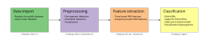
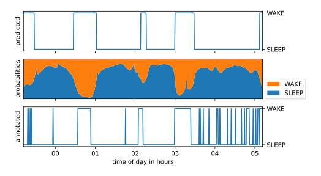

# Summary
SleepECG is an open-source Python package for sleep staging based on heart rate variability. It includes functions for downloading and importing polysomnography datasets, detecting heartbeats, and classifying sleep stages. The package ships classifiers pre-trained on thousands of publicly available labeled records. SleepECG thus enables a fully open and reproducible sleep staging analysis (see \autoref{fig:workflow}).

# Statement of need
Sleep staging is the process of categorizing sleep into distinct stages, which typically include wakefulness, rapid eye movement (REM) sleep, and non-rapid eye movement (NREM) sleep [@Silber:2007]. Usually, multi-channel electroencephalography (EEG) is the main source of information for distinguishing between sleep stages, but EEG recording is expensive and often negatively impacts sleep quality. Therefore, sleep staging based on other modalities such as heart rate could shorten setup time, lower costs, and improve comfort [@Agnew:1966]. However, it is still unclear if sleep staging based on heart rate is accurate enough to be a viable alternative to the EEG-based gold standard.

Although there are several published studies on sleep staging based on heart rate, very few of them are completely open and reproducible. That is, either the processing pipeline (which includes signal preprocessing and training machine learning models) or the dataset used to generate the published results are not publicly available. In many cases, neither code nor data are made available, not even upon request. This is the main reason why we developed the SleepECG package[^1].

[^1]: Related repositories dedicated to sleep staging based on heart rate include [github.com/ojwalch/sleep_classifiers](https://github.com/ojwalch/sleep_classifiers), [github.com/Acrophase/Sleep_Staging_KD](https://github.com/Acrophase/Sleep_Staging_KD), and [github.com/bzhai/multimodal_sleep_stage_benchmark](https://github.com/bzhai/multimodal_sleep_stage_benchmark) [@Zhai:2020]. However, we did not use any parts of these projects, and in contrast to SleepECG, they are not available as a Python package.

SleepECG is an open-source Python package which aims to facilitate reproducible research in the area of sleep staging based on electrocardiographic (ECG) recordings. It includes functions for downloading and importing open polysomnography datasets, detecting heartbeats, and classifying sleep stages, as well as classifiers pre-trained on thousands of publicly available data records.

Downloaders with a common API are available for several large datasets (support for more datasets can easily be added in the future), including the [Multi-Ethnic Study of Atherosclerosis](https://sleepdata.org/datasets/mesa/) (MESA) [@Chen:2015; @Zhang:2018], the [Sleep Heart Health Study](https://sleepdata.org/datasets/shhs/) (SHHS) [@Quan:1997; @Zhang:2018], and the [MIT-BIH Polysomnographic Database](https://physionet.org/content/slpdb) [@Ichimaru:1999]. These data sets include thousands of labeled sleep stages, which can be used to train and validate custom classifiers. In addition, SleepECG is currently the only working Python package which provides convenient access to [NSRR](https://sleepdata.org/) datasets (like MESA and SHHS).

When no heartbeat annotations are available, SleepECG provides its own heartbeat detector based on the algorithm first described by Pan and Tompkins [@Pan:1985]. Performance-critical code is available as a C extension, which makes the detector substantially (between 5 and 1000 times) faster than existing Python implementations while maintaining high detection accuracy. \autoref{fig:runtime} shows results for several detectors from our benchmark (which is available in [`examples/benchmark/`](https://github.com/cbrnr/sleepecg/tree/main/examples/benchmark))[^2].

[^2]: The C extension is completely optional since we also provide a fallback pure Python implementation (which can also be accelerated via Numba).

 records (tested on an Intel Xeon E5-2440v2 with 32 GiB RAM). The y-axis is logarithmically scaled.\label{fig:runtime}](ltdb_runtime_logscale.svg){width=80%}

Once heartbeats are available, heart rate variability is the basis for computing numerous features. SleepECG currently supports 26 time domain and 7 frequency domain features described in @TFESC:1996 and @Shaffer:2017. These features are based on heartbeat intervals, successive differences, Poincaré plots, or the power spectral density. All or selected features can be used to train a classifier, which then performs sleep staging on unseen data.

Any machine learning model can be used for sleep staging, but SleepECG already comes with several pre-trained neural network classifiers using gated recurrent units via [Tensorflow](https://www.tensorflow.org/) [@Tensorflow:2023] and all available feature types. On average, the bundled wake/sleep classifier achieves an accuracy of 83% on 1000 unseen test data records, whereas the wake/REM/NREM classifier reaches 75%. \autoref{fig:hypnogram} shows a hypnogram based on the pre-trained wake/sleep classifier on an exemplary unseen dataset.

In summary, SleepECG provides tools for every step in the ECG-based sleep staging pipeline. Importantly, all tools are open and reproducible, including code as well as train and test data sets. Therefore, even though sleep staging based on heart rate has not been extensively validated yet, SleepECG is an important first step towards this goal.

# Acknowledgments
A big thank you goes out to all contributors who have fixed bugs or implemented new functionality. As with almost any open source project, new contributions are always welcome!

# References